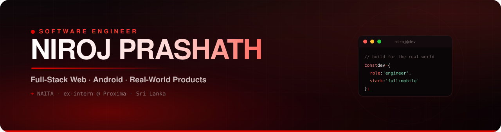

<!-- =========================================================
     NIROJ PRASHATH · GitHub Profile README
     Theme: cinematic black + deep red (matches portfolio)
     Palette: bg #070406 · red #E10600 · accent #FF3B30 · text #C9B6B8
     ========================================================= -->

<p align="center">
  
</p>

<!-- ===== Typing headline ===== -->
<p align="center">
  <a href="https://github.com/NirojPrashath">
    
  </a>
</p>

<!-- ===== Social / contact ===== -->
<p align="center">
  <a href="https://www.linkedin.com/in/niroj-prashath-493631367"></a>
  <a href="https://github.com/NirojPrashath"></a>
  <a href="https://www.instagram.com/mr_redwolf_toro"></a>
  <a href="https://wa.me/94719824282"></a>
  <a href="mailto:yogeswarannirojprashath@gmail.com"></a>
  
</p>

<br/>

<!-- ===================== ABOUT ===================== -->
##  `> whoami`

```ts
const niroj = {
  role: "Software Engineer",
  education: "Software Engineering @ NAITA",
  experience: "ex-intern @ Proxima Private Limited",
  focus: ["Full-Stack Web", "Android", "Real-world products"],
  currentlyBuilding: "RAASTA 🚑 — clearing the road for ambulances",
  location: "Sri Lanka 🇱🇰",
  motto: "Clean code. Software that actually ships.",
};
```

- 🎓 &nbsp;Software Engineering student at **NAITA**
- 💼 &nbsp;Completed an industry internship at **Proxima Private Limited**
- 🚑 &nbsp;Building **RAASTA** — a Google *"Fund My Crazy"* Build Night 2026 project
- 🎟️ &nbsp;Built **B-Ceylon** — a full booking platform (website + Android admin & booking apps)
- 🌱 &nbsp;Always leveling up in system design, clean architecture & great UX
- 💬 &nbsp;Ask me about **Kotlin, JavaScript, full-stack web, or Android**

<br/>

<!-- ===================== TECH STACK ===================== -->
##  `> tech_stack`

**Languages**
<p>
  
  
  
  
  
  
  
</p>

**Frontend & Mobile**
<p>
  
  
  
  
</p>

**Backend, Data & Cloud**
<p>
  
  
  
  
</p>

**Tools**
<p>
  
  
  
  
  
</p>

<br/>

<!-- ===================== FEATURED PROJECTS ===================== -->
##  `> featured_projects`

| 🚀 Project | What it is | Stack |
|---|---|---|
| **🚑 RAASTA** | Emergency-response system — ambulances broadcast, drivers get a ~1-min heads-up in the map they already use. *A siren gives 3 seconds; Raasta gives 3 minutes.* | Kotlin · Compose · Maps SDK · Gemini |
| **🎟️ B-Ceylon** | Full-stack booking platform: live seat inventory, QR + CODE128 tickets, PDF export + companion Android **admin** (PIN-locked, real-time revenue) & **booking** apps. | JavaScript · Node · Android |
| **💸 Income & Expense Tracker** | Command-line personal finance tracker with clean reporting. | Python |
| **🏧 ATM Simulation** | Desktop ATM app with accounts, PIN auth & transactions. | Java · JavaFX |
| **👛 Personal Wallet** | Responsive cross-platform wallet web app. | HTML · CSS · JS |
| **📔 Memory Lane** | A digital diary app with cloud sync. | Kotlin · Firebase |

<br/>

<!-- ===================== GITHUB STATS ===================== -->
##  `> github_stats`

<p align="center">
  
</p>

<!-- Contribution snake (needs the GitHub Action in SETUP.md) -->
<p align="center">
  
</p>

<br/>

<!-- ===================== FOOTER ===================== -->
<p align="center">
  
</p>
<p align="center"><i>“A siren gives you 3 seconds. Raasta gives you 3 minutes.”</i></p>
