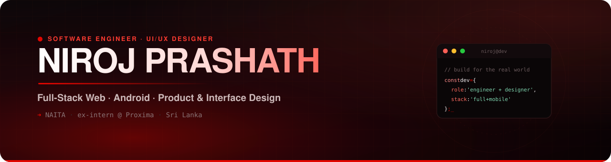

<!-- ========================================================= NIROJ PRASHATH · GitHub Profile README Theme: cinematic black + deep red (matches portfolio) Palette: bg #070406 · red #E10600 · accent #FF3B30 · text #C9B6B8 ========================================================= -->
  
<!-- ===== Typing headline ===== -->
  
<!-- ===== Social / contact ===== -->
       
 <!-- ===================== ABOUT ===================== -->
 > whoami
TypeScript

const niroj = {
  role: "Software Engineer & UI/UX Designer",
  education: "Software Engineering @ NAITA",
  experience: "Software Engineering Intern @ Proxima Private Limited",
  focus: ["UI/UX & Product Design", "Full-Stack Web", "Android"],
  selectedWork: ["RAASTA", "Iron Tide", "Knuckles Roasters", "B-Ceylon", "Vet Lanka", "Wayfarer"],
  location: "Sri Lanka 🇱🇰",
  motto: "Design for people. Engineer with intent.",
};
🎓  Software Engineering student at NAITA
💼  Completed an industry internship at Proxima Private Limited
🧭  I bring interface design and engineering together to build human-first digital products
🚑  RAASTA — an emergency-response concept for Google’s Fund My Crazy Build Night 2026
🎟️  B-Ceylon — booking and ticketing software with live seat inventory and digital tickets
💬  Ask me about Kotlin, JavaScript, Android, UI/UX, or product design
 <!-- ===================== TECH STACK ===================== -->
 > tech_stack
Product & Interface
Figma · Responsive UI · Interaction design · Product thinking

Languages

        

Frontend & Mobile

     

Backend, Data & Platforms

      

Tools

     
 <!-- ===================== FEATURED PROJECTS ===================== -->
 > featured_projects
Six current case studies across mobility, fitness, commerce, healthcare, and travel.

🚀 Project	What it is	Stack / scope
🚑 RAASTA	Emergency-response concept that alerts nearby drivers as an ambulance approaches, with a live route countdown, voice guidance, and pull-aside instructions in Tamil, Sinhala, English, and Hindi. Highlights about a minute of advance warning.	Kotlin · Jetpack Compose · Maps SDK · Directions API · Gemini Vision
🏋️ Iron Tide	Gym website for planning a first visit, with coaching, programmes, timetable, membership, visit details, and trial-class booking.	8 routes · 5 switchable colour directions
☕ Knuckles Roasters	Ceylon coffee storefront spanning discovery, product pages, cart, checkout, subscriptions, brew guide, and wholesale.	11 routes · 58 UI components · 110 source files
🎟️ B-Ceylon	Booking and ticketing platform with live seat inventory, seat locking, digital tickets for gate scanning, and PDF downloads.	JavaScript · Apps Script API · Google Sheets · QR + CODE128
🐾 Vet Lanka Animal Hospital	Website for a real veterinary practice, helping pet owners review services, check opening status, plan a visit via WhatsApp, and explore the pet shop.	Healthcare web · 6 routes
✈️ Wayfarer	Global stays and experiences booking product, with discovery, search, stay details, checkout, confirmation, and trip management.	7 routes · 8 cities · 5 continents · 6 currencies
 <!-- ===================== SUPPORTING BUILDS ===================== -->
 > supporting_builds
Project	What it does	Stack
Admin Control App	Organiser app for PIN-protected booking and revenue views, booking search, and cancellations.	Kotlin · Jetpack Compose
Booking Mobile App	Customer app to browse access tiers, reserve, and carry a digital QR ticket.	Kotlin · Material UI · REST
Income & Expense Tracker	Command-line tool to log, categorise, and summarise income and expenses.	Python · File I/O
ATM Simulation System	Desktop simulator for account balances, withdrawals, and deposits.	Java · JavaFX · OOP
Personal Wallet	Responsive wallet website for desktop and mobile.	HTML · CSS · JavaScript · Backend
Digital Diary — Memory Lane	Android diary for managing entries, with real-time sync across devices.	Kotlin · Firebase
 <!-- ===================== GITHUB STATS ===================== -->
 > github_stats

  
<!-- Contribution snake (needs the GitHub Action in SETUP.md) -->
  
 <!-- ===================== FOOTER ===================== -->
  

